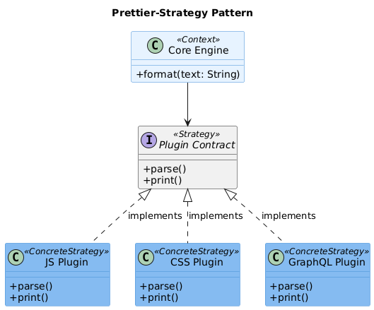
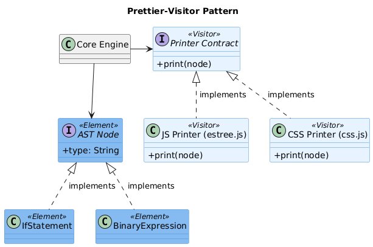
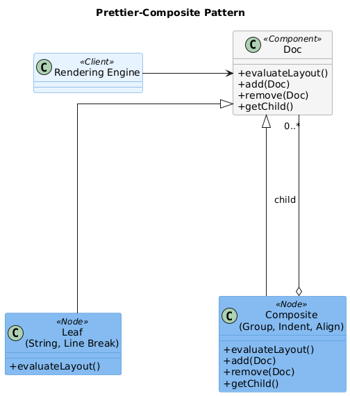
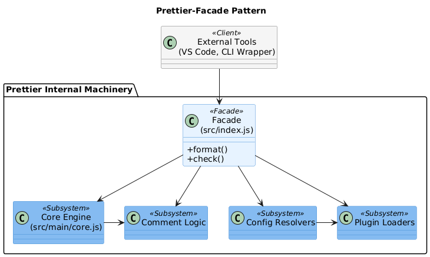
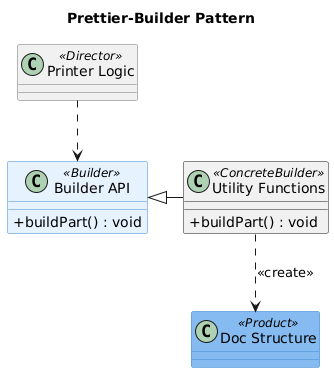

# Software Design

## 1. Dependencies

### Method and Tools Used

The dependency analysis was performed to evaluate the code and knowledge dependencies among the software modules within the Prettier project, specifically focusing on the `src/` directory to isolate the core business logic.
To extract code dependencies based on explicit `import` statements, tools such as `madge`, `dependency-cruiser`, and custom PowerShell scripts combined with standard Unix text processing utilities (`grep`, `awk`) were utilized. Furthermore, `dependency-cruiser` output metrics were analyzed to calculate Afferent Coupling (Fan-in), Efferent Coupling (Fan-out) and Instability.
For knowledge dependencies (logical coupling), `git log` was employed to analyze the recent commit history (e.g., the last 1000 commits from tags like `3.8.2`) to identify files that are frequently modified together in the same commits.

```bash
command for table generation: npx dependency-cruiser src --no-config --output-type metrics > dependency_metrics.txt
```

### Code Dependencies
Based on the explicit imports in the source code, we investigated which files act as central hubs (high efferent coupling), which serve as core foundational blocks (high afferent coupling), and which act as independent atomic utilities (low efferent coupling).

**High Efferent Coupling (Fan-out) - Files with the most dependencies:**

```bash
command: grep "src/.*\.js" dependency_metrics.txt | sort -k5 -nr | head -n 6
```

1. `src/language-js/print/flow.js` (35 imports)
2. `src/language-js/print/typescript.js` (33 imports)
3. `src/language-js/print/estree.js` (29 imports)
4. `src/plugins/builtin-plugins-proxy.js` (27 imports)
5. `src/index.js` (22 imports)
6. `src/language-markdown/printer-markdown.js` (21 imports)


These files function as architectural "Hubs" or "Orchestrators" and show a very high Instability index (close to 97%). Prettier operates by parsing source code into an Abstract Syntax Tree (AST) and then transforming it into a formatted document. The language-specific printers (`flow.js`, `typescript.js`, `estree.js`) are "builders" that need to handle every single type of language construct (arrays, classes, functions, loops). Consequently, they aggregate numerous specialized micro-modules for each construct, explaining their immense fan-out. Files like `index.js` and `builtin-plugins-proxy.js` serve as system entry points, aggregating all supported plugins and languages to expose a unified API to the user.

**High Afferent Coupling (Fan-in) - The most "popular" files:**

Certain files are heavily depended upon; if they break, the system collapses. These modules act as architectural gravity centers: their high coupling means any regression triggers a ripple effect, where a single breaking change causes widespread instability across the entire codebase.

```bash
command: grep "src/.*\.js" dependency_metrics.txt | sort -k4 -nr | head -n 5
```

1. `src/document/index.js` (Over 90 incoming dependencies): Prettier relies on an intermediate formatting representation called "Doc". This file exports the primitives required to build this format. Every supported language printer must import it.
2. `src/language-js/utilities/index.js` (Over 40 incoming dependencies): Acts as a dictionary for the AST node types, constantly queried by the JavaScript printing modules.
3. Cross-cutting utilities (e.g., `utilities/is-non-empty-array.js` or `main/comments/print.js`): Universal operations centralized to prevent code duplication, imported across parsers and printers of all languages.

**Low Efferent Coupling - Files with the least dependencies:**

``` bash
command: grep "src/.*\.js" dependency_metrics.txt | sort -k5 -n | head -n 5
```

1. `src/cli/options/create-minimist-options.js`
2. `src/common/errors.js`
3. `src/document/printer/indent.js`
4. `src/common/parser-create-error.js`

(`src/common/ast-path.js` is not shown in the output because it is a module imported by a lot of files, so it would not be correct to call it a stable leaf node)

These files are atomic utilities or "Leaves" located at the base of the dependency pyramid, boasting an Efferent Coupling (Ce) of 0. They contain pure logic, constant definitions, or simple helper algorithms. By strictly following the Single Responsibility Principle and avoiding core imports, they provide extreme stability. If the system undergoes massive refactoring, these leaf nodes will likely remain unchanged.

### Knowledge Dependencies
Knowledge dependencies were identified by evaluating logical coupling through co-change analysis in the Git history.

*Command:*
```bash
git --no-pager log -n 500 --name-only --pretty=format:"--- COMMIT ---" -- src/ | python3 -c '
import sys
from itertools import combinations
from collections import Counter

lines = sys.stdin.read().splitlines()
commits = []
current_commit = []

for line in lines:
    if line == "--- COMMIT ---":
        if current_commit:
            commits.append(list(set(current_commit)))
        current_commit = []
    elif line.strip():
        current_commit.append(line.strip())
if current_commit:
    commits.append(list(set(current_commit)))

co_changes = Counter()
for files in commits:
    if len(files) > 1:
        for pair in combinations(sorted(files), 2):
            co_changes[pair] += 1

print(f"{"Freq":<6} | {"File A":<45} | {"File B"}")
print("-" * 100)
for (file1, file2), count in co_changes.most_common(10):
    print(f"{count:<6} | {file1:<45} | {file2}")
'
```

*Output:*
| Freq | File A | File B | Result |
|------|--------|--------|--------|
| 11 | `src/language-js/parse/acorn.js` | `src/language-js/parse/babel.js` | Inconsistent |
| 8 | `src/language-js/print/flow.js` | `src/language-js/print/function.js` | Inconsistent |
| 8 | `src/language-js/print/flow.js` | `src/language-js/print/object.js` | Inconsistent |
| 8 | `src/language-js/print/flow.js` | `src/language-js/print/type-annotation.js` | Consistent |
| 8 | `src/language-js/print/function-parameters.js` | `src/language-js/print/type-annotation.js` | Inconsistent |
| 8 | `src/language-js/print/object.js` | `src/language-js/print/typescript.js` | Inconsistent |
| 8 | `src/language-js/print/type-annotation.js` | `src/language-js/print/typescript.js` | Inconsistent |
| 8 | `src/language-html/embed.js` | `src/language-html/utilities/index.js` | Consistent |
| 8 | `src/language-js/print/estree.js` | `src/language-js/utilities/index.js` | Consistent |
| 7 | `src/language-js/parse/acorn.js` | `src/language-js/parse/espree.js` | Inconsistent |

**Consistencies with Code Dependencies:**

Among the ten strongest co-changing file pairs, only three also exhibit a direct static dependency relationship. In these cases, the commit history confirms the import relationships identified during the code dependency analysis.

- **`flow.js` and `type-annotation.js`:**
These files both co-change frequently and directly depend on each other through imports. Their synchronized evolution suggests that modifications to Flow-specific formatting rules often require updates to the type annotation logic.

- **`embed.js` and `language-html/utilities/index.js`:**
This pair represents another case where logical coupling matches static dependencies. Since `embed.js` relies on shared HTML utilities, changes affecting embedded-language formatting are naturally reflected in both files.

- **`estree.js` and `language-js/utilities/index.js`:**
The JavaScript printer and its utility module also show both co-change and direct import relationships. This indicates that updates to the ESTree printer frequently require adjustments to the supporting utility functions.

Overall, these examples demonstrate that some knowledge dependencies are already made explicit in the source code through import relationships.

**Inconsistencies with Code Dependencies:**

The majority of the strongest co-changing pairs do not share any direct import relationship. Out of the ten pairs identified, seven represent hidden logical dependencies that are invisible to the static dependency analysis.

- **Parallel parser implementations:**
Files such as `acorn.js`, `babel.js`, and `espree.js` frequently change together even though they do not import one another. Their co-evolution suggests coordination requirements that are not represented in the source code structure.

- **Related printer modules:**
Several printer files, including `flow.js`, `function.js`, `object.js`, `function-parameters.js`, `type-annotation.js`, and `typescript.js`, appear repeatedly among the most common co-change pairs despite the absence of direct dependencies between them. Although these files are structurally independent, developers often modify them together, revealing a form of implicit coupling captured only by the commit history.

Overall, the results show that static dependencies describe only part of the architecture. While import relationships reveal explicit code connections, co-change analysis exposes additional coordination requirements that remain hidden in the dependency structure.

---

## 2. Patterns

An extensive analysis of the source code revealed a sophisticated usage of architectural design patterns, necessary to manage the extreme complexity of a multi-language AST-based formatter. Below are 5 key patterns identified in the codebase.

### 2.1 Strategy Pattern (Behavioral)


> *Figure 1: Strategy Pattern Diagram*

**Classes/Role:** 
Within the Prettier architecture, the Strategy Pattern is implemented by treating the Core orchestration modules (`src/main/core.js` and `src/main/index.js`) as the Context, which manages the high-level formatting workflow. The system defines a Strategy Interface through a strict Plugin Contract, requiring every language module to expose standardized capabilities such as `parse` and `print`. These requirements are fulfilled by Concrete Strategies—the individual plugin modules found in the `src/language-*` directories, such as the `src/language-css/parser-postcss.js` or the `src/language-html/index.js`. By delegating specific parsing and printing rules to these active strategies, Prettier solves the problem of behavioral variation without tightly coupling the core engine to the intricacies of specific syntaxes like GraphQL or CSS. This design guarantees the Open/Closed Principle, allowing the system to remain highly extensible; new languages can be integrated entirely by adding new strategies, which the core then selects at runtime based on file extensions without requiring any internal modifications.


**Alternatives (Pros & Cons):** 
- *Alternative:* A massive monolithic procedural `switch-case` statement residing in the core.
- *Pros:* Easier to trace execution flow linearly for very small, single-language projects. Might be marginally faster by avoiding dynamic loading.
- *Cons:* Disastrous for scalability. It completely blocks community extensibility (third-party plugins), and any update carries a high risk of breaking unrelated languages due to massive code entanglement.

### 2.2 Visitor Pattern (Behavioral)


> *Figure 2: Visitor Pattern Diagram*

**Classes/Role:** 
In this implementation of the Visitor Pattern, Prettier adapts the classic object-oriented structure to fit a functional paradigm. The Visitor role is occupied by the Printer modules, such as `src/language-js/print/estree.js`, which utilize the central `genericPrint()` dispatcher—a function containing an extensive `switch (node.type)` block to handle different logic for each element. The Elements being visited are the Abstract Syntax Tree (AST) nodes, which are treated as immutable JSON objects (e.g., `IfStatement` or `BinaryExpression`) generated by external parsers. To navigate these complex structures, a Navigator function, `createGetVisitorKeysFunction`, acts as the structural map that guides the Visitor to the specific keys containing traversable child nodes. By implementing this pattern, Prettier effectively decouples the formatting logic from the physical AST data structure, solving the challenge of managing deeply hierarchical and recursive trees. This allows the engine to apply sophisticated, node-specific formatting across dozens of distinct node types without ever needing to modify the underlying node definitions.

**Alternatives (Pros & Cons):** 
- *Alternative:* Injecting `print()` methods directly inside the AST node classes (procedural/classic OOP).
- *Pros:* Excellent encapsulation, highly intuitive (e.g., `node.print()`), and less boilerplate.
- *Cons:* Utterly impossible when AST nodes are generated by third-party libraries (like Babel or Flow). It violates the Single Responsibility Principle by polluting purely structural data representations with complex formatting behaviors.

### 2.3 Composite Pattern (Structural)


> *Figure 3: Composite Pattern Diagram*

**Classes/Role:** 
The Composite Pattern is central to Prettier’s architecture, enabling its sophisticated line-wrapping logic through a unified Intermediate Representation (IR). The Component role is defined by the `Doc` interface, which serves as the common denominator for every formatting fragment. This interface is implemented by both Leaf nodes—atomic elements like basic strings or line breaks that contain no further formatting—and Composites, such as `group`, `indent`, or `align`. These composites enclose child `Doc` fragments to form infinitely nested hierarchies. By utilizing this pattern, Prettier solves the critical challenge of "Line Wrapping Management": because the rendering engine treats simple text and complex nested groups as identical `Doc` types, it can evaluate the layout uniformly. This structure allows the engine to calculate a group's total width and intelligently decide whether to "break" the composite across multiple lines if it exceeds the column limit, ensuring consistent formatting regardless of the tree's depth.

**Alternatives (Pros & Cons):** 
- *Alternative:* Single-Pass String Builder (direct string generation while navigating the AST).
- *Pros:* Marginally faster execution and lower memory overhead since no intermediate tree is allocated.
- *Cons:* Advanced formatting becomes a maintenance nightmare. Code would be flooded with endless lookahead logic and conditional checks for line lengths, completely entangling formatting intent with spatial calculation.

### 2.4 Facade Pattern (Structural)


> *Figure 4: Facade Pattern Diagram*

**Classes/Role:** 
Prettier implements the Facade Pattern to streamline the interaction between external integrators and its complex internal machinery. The Facade role is played by the main entry point, `src/index.js`, which serves as the primary gateway to the library. Behind this simplified interface lies a dense network of Subsystems, including the core orchestration engine (`src/main/core.js`), plugin loaders, configuration resolvers, and comment attachment logic. This design solves the problem of high internal complexity by exposing only a few intuitive methods, such as `format()` and `check()`, to the user. By shielding external tools—like VS Code extensions or CLI wrappers—from the intricate manual wiring of parsers, options, and printers, the Facade ensures the system remains accessible and easy to integrate while maintaining the flexibility of its modular architecture.

**Alternatives (Pros & Cons):** 
- *Alternative:* Direct exposure of all internal submodules.
- *Pros:* Maximum granular control for power users.
- *Cons:* A highly unstable public API where internal refactoring immediately breaks third-party implementations and a steep learning curve for integration.

### 2.5 Builder Pattern (Creational)


> *Figure 5: Builder Pattern Diagram*

**Classes/Role:** 
Prettier utilizes the Builder Pattern to streamline the dynamic creation of its nested Intermediate Representation. The Builders are specialized utility functions located in `src/document/builders/`, such as `group()`, `indent()`, and `ifBreak()`, which act as the construction interface. These functions generate the Product: the final, complex Doc structure used for rendering. This pattern solves the problem of object construction boilerplate; by providing a clean, functional API to abstract away the intricate details of object instantiation, Prettier allows the printer logic to remain focused on high-level formatting algorithms. This ensures that the creation of valid, deeply nested fragments is both uniform and readable, preventing the codebase from being cluttered with verbose and error-prone JSON structures.

**Alternatives (Pros & Cons):** 
- *Alternative:* Direct manual instantiation of JSON objects inside the printer files.
- *Pros:* Slightly fewer function calls.
- *Cons:* Extremely verbose, highly error-prone, and very fragile if the internal definition of a `Doc` node changes in the future.

---

## 3. Summary

**Summary of the findings of the two design aspects:**
The architectural design of Prettier demonstrates an exceptional degree of modularity, deliberately engineered to tackle the immense complexity of supporting dozens of different programming languages with perfectly consistent formatting rules. 

From the **Dependency Analysis**, the repository exhibits a healthy, pyramid-like structure. Complex orchestrators ("Hubs") manage the macroscopic execution flow by aggregating numerous dependencies, while at the bottom, "Leaf" utilities provide zero-dependency, hyper-stable support functions. The **Knowledge Dependencies** via co-change analysis provided vital insight: physical code coupling is only half the story. The plugin-based architecture forces developers to synchronize updates across statically independent files (such as multiple parallel parsers or cross-language plugin APIs), proving that architectural interfaces often dictate development workflows stronger than explicit imports.

From the **Pattern Analysis**, Prettier's structural and behavioral decisions perfectly align with its core mission. By utilizing the **Facade** pattern, it hides a massive ecosystem behind a trivial API. The **Strategy** pattern guarantees absolute extensibility, allowing community plugins to seamlessly integrate. The **Visitor** pattern ensures that the system's formatting logic remains untethered from external, third-party data structures (ASTs). Finally, the combination of **Composite** and **Builder** patterns orchestrates Prettier's true innovation: an Intermediate Representation (Doc) that mathematically guarantees optimal line wrapping and grouping by calculating spatial constraints before any text is actually rendered. Together, these design aspects ensure Prettier remains robust, testable, and infinitely scalable.
